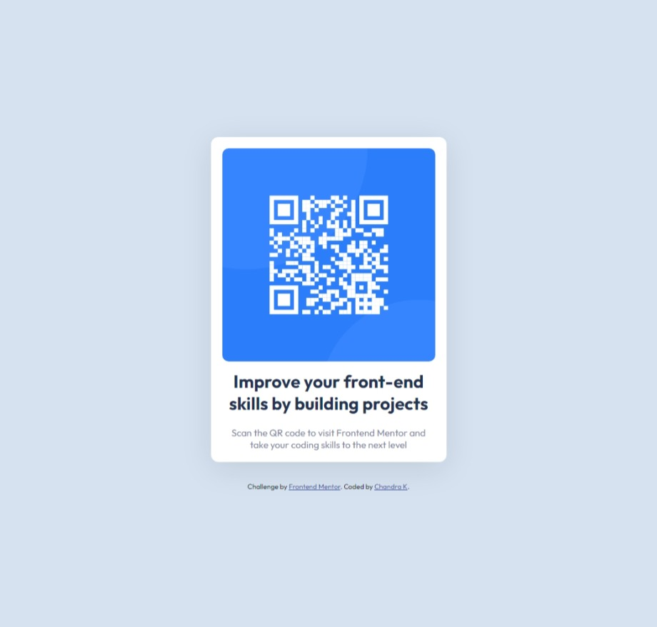

# Frontend Mentor - QR code component solution

This is a solution to the [QR code component challenge on Frontend Mentor](https://www.frontendmentor.io/challenges/qr-code-component-iux_sIO_H). Frontend Mentor challenges help you improve your coding skills by building realistic projects.

## Table of contents

- [Overview](#overview)
  - [Screenshot](#screenshot)
  - [Links](#links)
- [My process](#my-process)
  - [Built with](#built-with)
  - [What I learned](#what-i-learned)
  - [Continued development](#continued-development)
- [Author](#author)
- [Acknowledgments](#acknowledgments)

**Note: Delete this note and update the table of contents based on what sections you keep.**

## Overview

### Screenshot



### Links

- Solution URL: ([https://your-solution-url.com](https://github.com/Chandrakhd/FrontEndMentorChallenges/tree/main/Qr-Code-Component))
- Live Site URL: ([https://your-live-site-url.com](https://chandrakhd.github.io/FrontEndMentorChallenges/Qr-Code-Component/))

## My process

### Built with

- Semantic HTML5 markup
- CSS custom properties
- Flexbox

### What I learned

While building this project I learned to write minimal code without repeating.

```css
.container {
  height: 100vh;
  display: flex;
  flex-direction: column;
  justify-content: center;
  align-items: center;
}
```

### Continued development

My future plan is to continue doing the challenges from the fronend mentor and improve on building fully responsive with the integrating the backend as well.

## Author

- Frontend Mentor - [@Chandrakhd]([https://www.frontendmentor.io/profile/yourusername](https://www.frontendmentor.io/profile/Chandrakhd)https://www.frontendmentor.io/profile/Chandrakhd)
