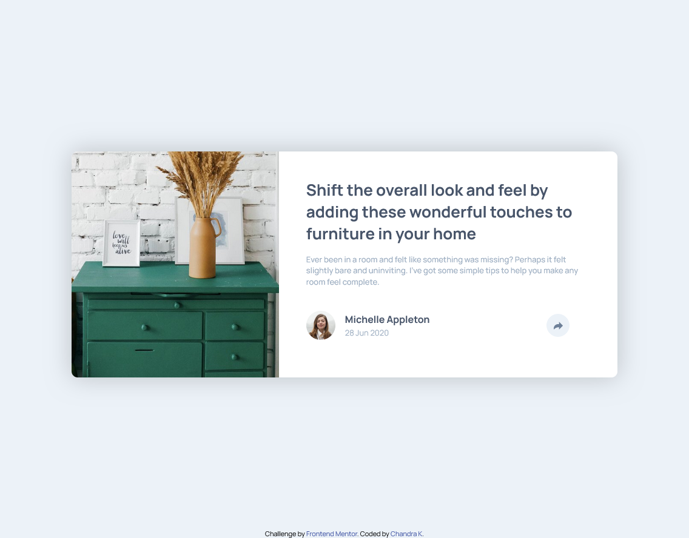

# Frontend Mentor - Article preview component solution

This is a solution to the [Article preview component challenge on Frontend Mentor](https://www.frontendmentor.io/challenges/article-preview-component-dYBN_pYFT). Frontend Mentor challenges help you improve your coding skills by building realistic projects.

## Table of contents

- [Overview](#overview)
  - [The challenge](#the-challenge)
  - [Screenshot](#screenshot)
  - [Links](#links)
- [My process](#my-process)
  - [Built with](#built-with)
  - [What I learned](#what-i-learned)
  - [Continued development](#continued-development)
  - [Useful resources](#useful-resources)
- [Author](#author)

## Overview

- It's simple yet fun challenge to work on

### The challenge

Users should be able to:

- View the optimal layout for the component depending on their device's screen size
- See the social media share links when they click the share icon

### Screenshot



### Links

- Solution URL: (https://github.com/Chandrakhd/FrontEndMentorChallenges/tree/main/article-preview-component-master)
- Live Site URL: (https://chandrakhd.github.io/FrontEndMentorChallenges/article-preview-component-master/)

## My process

### Built with

- Semantic HTML5 markup
- CSS custom properties
- Flexbox
- CSS Grid
- Mobile-first workflow

### What I learned

- By doing this project I have learned to layout the content in different ways.
  To see how you can add code snippets, see below:

```js
 const shareBtn = document.querySelector(".shareBtn");
      const profileinfo = document.querySelector(".profile_info");

      const social_container = document.querySelector(".social_container");

      let socialVisible = false;
      shareBtn.addEventListener("click", function () {
        socialVisible = !socialVisible;

        if (socialVisible) {
          profileinfo.style.display = "flex";
          social_container.style.display = "none";
          social_container.style.visibility = "hidden";
        } else {
          profileinfo.style.display = "none";
          social_container.style.display = "flex";
          social_container.style.visibility = "visible";
        }
};
```

### Continued development

- I will continue to work on the project and challenges.

## Author

- Frontend Mentor - [@Chandrakhd](https://www.frontendmentor.io/profile/Chandrakhd)
