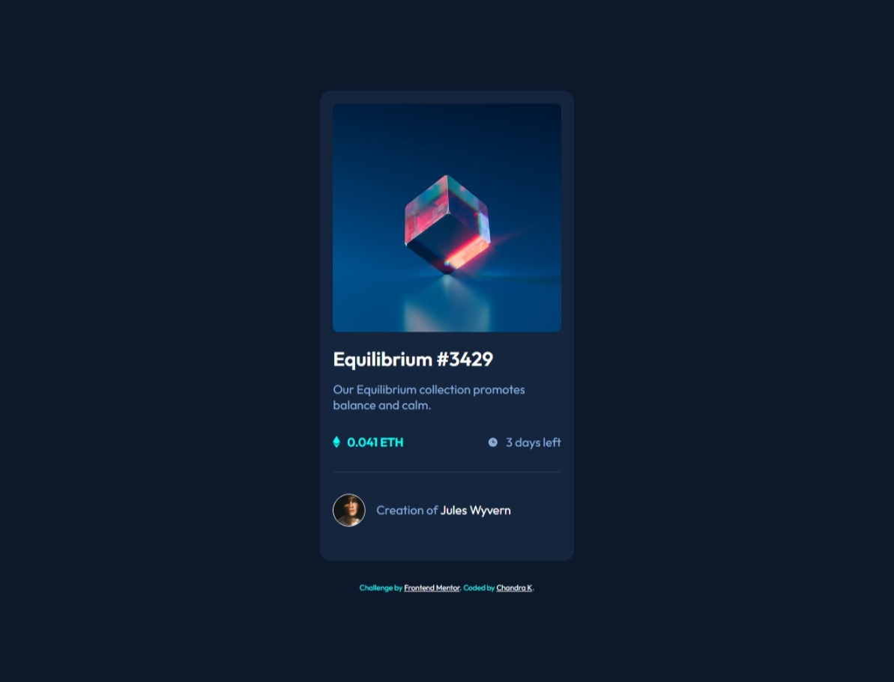

# Frontend Mentor - NFT preview card component solution

This is a solution to the [NFT preview card component challenge on Frontend Mentor](https://www.frontendmentor.io/challenges/nft-preview-card-component-SbdUL_w0U). Frontend Mentor challenges help you improve your coding skills by building realistic projects.

## Table of contents

- [Overview](#overview)
  - [The challenge](#the-challenge)
  - [Screenshot](#screenshot)
  - [Links](#links)
- [My process](#my-process)

  - [Built with](#built-with)
  - [What I learned](#what-i-learned)
  - [Continued development](#continued-development)

- [Author](#author)

## Overview

### The challenge

Users should be able to:

- View the optimal layout depending on their device's screen size
- See hover states for interactive elements

### Screenshot

### Links

- Solution URL: (https://github.com/Chandrakhd/FrontEndMentorChallenges/tree/main/nft-preview-card-component-main)
- Live Site URL: (https://chandrakhd.github.io/FrontEndMentorChallenges/nft-preview-card-component-main/)

## My process

- html, css

### Built with

- Semantic HTML5 markup
- CSS custom properties
- Flexbox
- CSS Grid
- Mobile-first workflow

### What I learned

- It helped to follow the semantic element and layout.

### Continued development

- I will keep doing the challenges and learn more about the grid, flex.

## Author

- Frontend Mentor - [@Chandrakhd](https://www.frontendmentor.io/profile/Chandrakhd)
