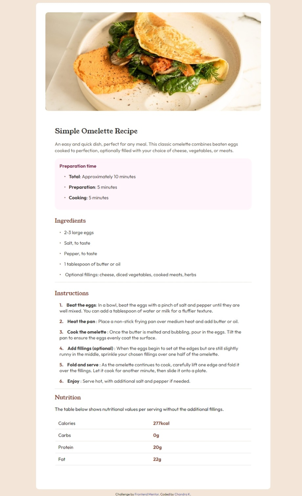
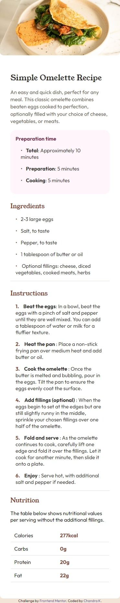

# Frontend Mentor - Recipe page solution

This is a solution to the [Recipe page challenge on Frontend Mentor](https://www.frontendmentor.io/challenges/recipe-page-KiTsR8QQKm). Frontend Mentor challenges help you improve your coding skills by building realistic projects.

## Table of contents

- [Overview](#overview)
  - [The challenge](#the-challenge)
  - [Screenshot](#screenshot)
  - [Links](#links)
- [My process](#my-process)
  - [Built with](#built-with)
  - [What I learned](#what-i-learned)
  - [Continued development](#continued-development)
  - [Useful resources](#useful-resources)
- [Author](#author)

### Screenshot




### Links

- Solution URL: (https://github.com/Chandrakhd/FrontEndMentorChallenges/tree/main/recipe-page-main)
- Live Site URL: (https://chandrakhd.github.io/FrontEndMentorChallenges/recipe-page-main/)

## My process

- Download the project to a folder.
- Open the design.
- Organize, link css, and color.

### Built with

- Semantic HTML5 markup
- CSS custom properties
- Flexbox

### What I learned

One of the challenging thing for me was to add the custom number and and bullet points on list element.

```css
ul li::before {
  content: "\2022";
  color: var(--primary-clr);
  display: inline-block;
  width: 1rem;
}
```

### Continued development

I am planning to do all of the challenges and build great project.

## Author

- Frontend Mentor - [@Chandrakhd](https://www.frontendmentor.io/profile/Chandrakhd)
