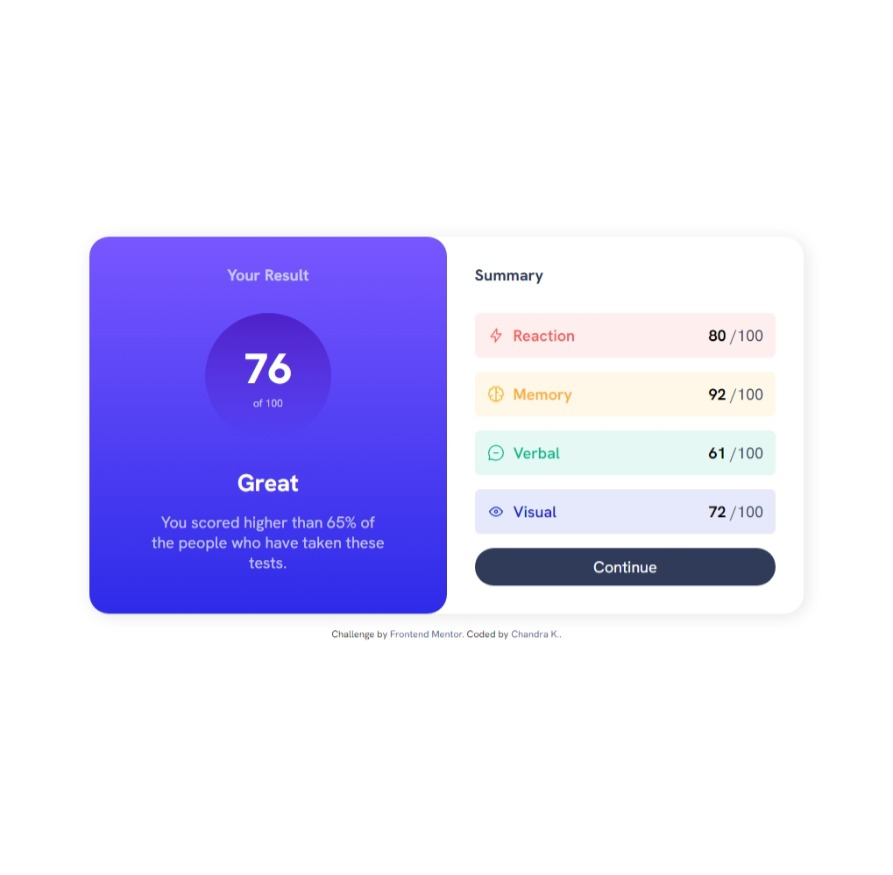
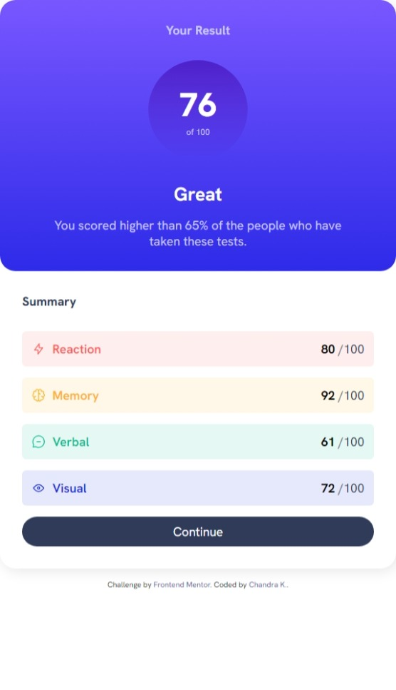

# Frontend Mentor - Results summary component solution

This is a solution to the [Results summary component challenge on Frontend Mentor](https://www.frontendmentor.io/challenges/results-summary-component-CE_K6s0maV). Frontend Mentor challenges help you improve your coding skills by building realistic projects.

## Table of contents

- [Overview](#overview)
  - [The challenge](#the-challenge)
  - [Screenshot](#screenshot)
  - [Links](#links)
- [My process](#my-process)
  - [Built with](#built-with)
  - [What I learned](#what-i-learned)
  - [Continued development](#continued-development)
- [Author](#author)

**Note: Delete this note and update the table of contents based on what sections you keep.**

## Overview

### The challenge

Users should be able to:

- View the optimal layout for the interface depending on their device's screen size
- See hover and focus states for all interactive elements on the page
- **Bonus**: Use the local JSON data to dynamically populate the content

### Screenshot




### Links

- Solution URL:(https://github.com/Chandrakhd/FrontEndMentorChallenges/tree/main/results-summary-component-main)
- Live Site URL: (https://chandrakhd.github.io/FrontEndMentorChallenges/results-summary-component-main/)

## My process

- I started building the project using html and css and later worked to the javascript to show the content dynamically.

### Built with

- Semantic HTML5 markup
- CSS custom properties
- Flexbox
- CSS Grid
- Mobile-first workflow

### What I learned

- Learned to focus on the layout, design, and content.

To see how you can add code snippets, see below:

```js
    let li = "";
    data.forEach((item) => {
      li += `
          <li class="list_item">
            
            <p class="category">${item.category}</p>
            <p class="list_right">
              <strong class="score">${item.score}</strong>
              <span>/100</span>
            </p>
          </li>
        `;
      const summaryDetail = document.querySelector(".summary_details");
```

### Continued development

- I will keep working on other challenges.

## Author

- Frontend Mentor - [@Chandrakhd](https://www.frontendmentor.io/profile/Chandrakhd)
