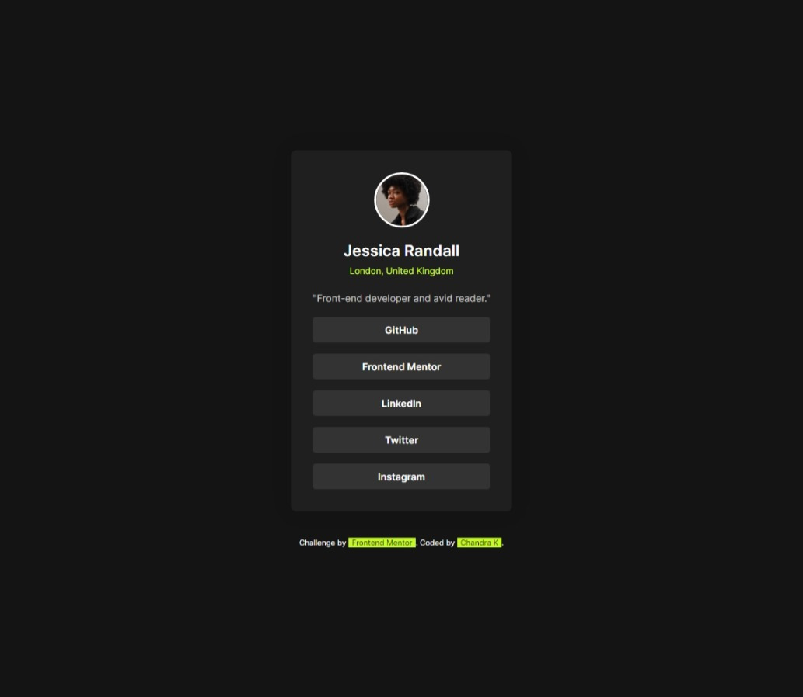

# Frontend Mentor - Social links profile solution

This is a solution to the [Social links profile challenge on Frontend Mentor](https://www.frontendmentor.io/challenges/social-links-profile-UG32l9m6dQ). Frontend Mentor challenges help you improve your coding skills by building realistic projects.

## Table of contents

- [Overview](#overview)
  - [The challenge](#the-challenge)
  - [Screenshot](#screenshot)
  - [Links](#links)
- [My process](#my-process)
  - [Built with](#built-with)
  - [What I learned](#what-i-learned)
  - [Continued development](#continued-development)
  - [Useful resources](#useful-resources)
- [Author](#author)

## Overview

### The challenge

Users should be able to:

- Shows about the user profile.

### Screenshot



### Links

- Solution URL: ([https://your-solution-url.com](https://github.com/Chandrakhd/FrontEndMentorChallenges/edit/main/social-links-profile-main/))
- Live Site URL:([https://your-live-site-url.com](https://chandrakhd.github.io/FrontEndMentorChallenges/social-links-profile-main/))

## My process

### Built with

- Semantic HTML5 markup
- CSS custom properties
- Flexbox
- CSS Grid
- Mobile-first workflow

### What I learned

I have learned the layout technique doing this project challenges.

```html
<div class="profile_container">
  <main class="profile">
    
    <h2 class="user_title">👍👍👍👍👍👍</h2>
    <p class="user_location"></p>
    <p class="user_job_position"></p>

    <ul class="social_links">
      <li class="link_item">
        <a href="#" class="btn_link"></a>
      </li>
      <li class="link_item">
        <a href="#" class="btn_link"></a>
      </li>
      <li class="link_item">
        <a href="#" class="btn_link"></a>
      </li>
      <li class="link_item">
        <a href="#" class="btn_link"></a>
      </li>
      <li class="link_item">
        <a href="#" class="btn_link"></a>
      </li>
    </ul>
  </main>
</div>
```

### Continued development

While doing this project I have added couple of nice touch on it like hover, and different layout. Excited to learn more.

## Author

- Frontend Mentor - [@Chandrakhd](https://www.frontendmentor.io/profile/Chandrakhd)
