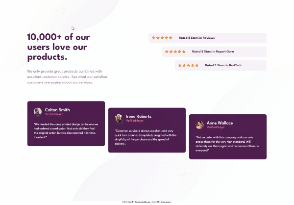
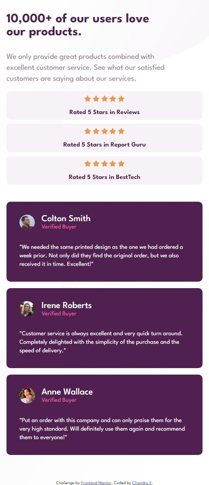

# Frontend Mentor - Social proof section solution

This is a solution to the [Social proof section challenge on Frontend Mentor](https://www.frontendmentor.io/challenges/social-proof-section-6e0qTv_bA). Frontend Mentor challenges help you improve your coding skills by building realistic projects.

## Table of contents

- [Overview](#overview)
  - [The challenge](#the-challenge)
  - [Screenshot](#screenshot)
  - [Links](#links)
- [My process](#my-process)
  - [Built with](#built-with)
  - [What I learned](#what-i-learned)
  - [Continued development](#continued-development)
  - [Useful resources](#useful-resources)
- [Author](#author)

## Overview

- This is great project to work on. All the animation has been done without writing single line of javascript code.

### The challenge

Users should be able to:

- View the optimal layout for the section depending on their device's screen size

### Screenshot




### Links

- Solution URL: (https://github.com/Chandrakhd/FrontEndMentorChallenges/tree/main/social-proof-section-master)
- Live Site URL: (https://chandrakhd.github.io/FrontEndMentorChallenges/social-proof-section-master/)

## My process

- Html css and after worked on the animation.

### Built with

- Semantic HTML5 markup
- CSS custom properties
- Flexbox
- CSS Grid
- Mobile-first workflow

### What I learned

- I have much more on this project and applied the skillset about the grid, flex, and animations.
  To see how you can add code snippets, see below:

```css
@media (max-width: 600px) {
  .social_section {
    height: auto;
  }
  .social_proof_container {
    padding: 2rem 1rem;
  }
}

@keyframes rating {
  0% {
    transform: translateX(100%);
  }
  100% {
    transform: translateX(0%);
  }
}
@keyframes cardLzyLoad {
  0% {
    transform: translateY(200%);
  }
  100% {
    transform: translateX(0%);
  }
}
```

### Continued development

I will keep doing the challenges and work on the projects.

## Author

- Frontend Mentor - [@Chandrakhd](https://www.frontendmentor.io/profile/Chandrakhd)
